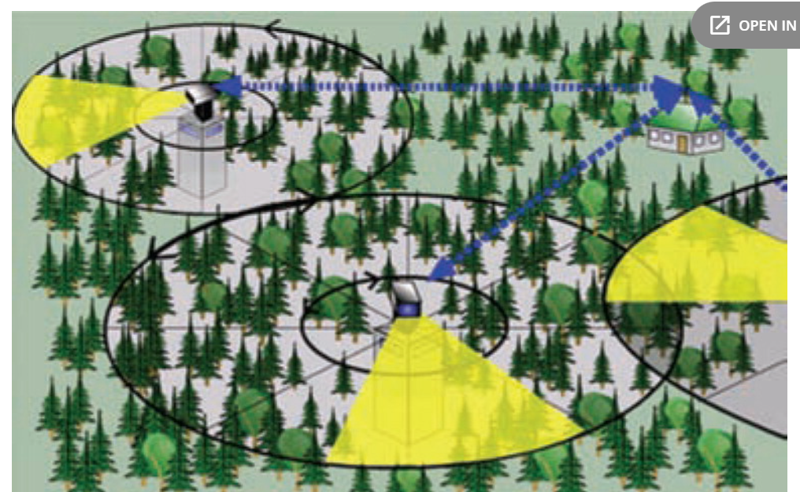
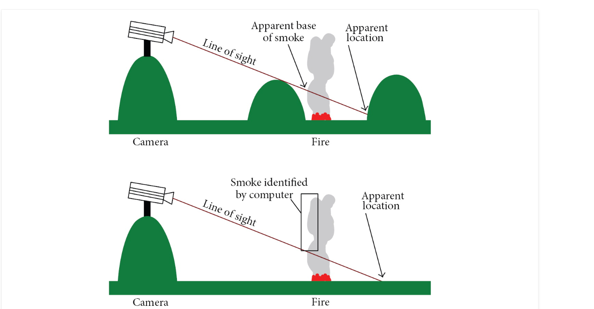
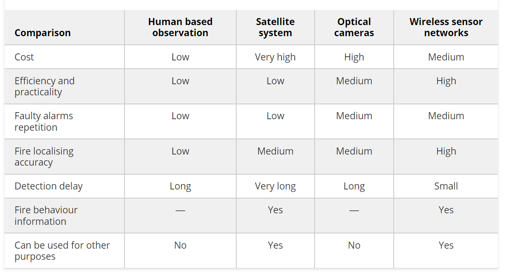

# Fire Detection Systems

Alkhatib, A. A. (2014). A review on forest fire detection techniques. International Journal of Distributed Sensor Networks, 10(3), 597368.

(i) video-camera, sensitive to visible spectrum of smoke recognisable during the day and a fire recognisable at night,
(ii) infrared (IR), thermal imaging cameras based on the detection of heat flow of the fire,
(iii) IR spectrometers to identify the spectral characteristics of smoke,
(iv) light detection and ranging systems—LIDAR (detection of light and range) that measure laser rays reflected from the smoke particles.

AlarmEYE is a video imaging system for forest fires early detection integrated with infrared, black and white and colour frequency detection.
EYEfi SPARC. Optical sensors produced by EYEfi, Australia, for forest fire detection

UraFire system is based on identifying smoke

The Forest Fire Finder employs intelligent analysis of atmospheric light absorption, distinguishing organic forest smoke from industrial emissions within a 15km range, often ForestWatch, an optical camera sensor system by EnviroVision Solutions, South Africa, utilizes tower cameras for day-time smoke and night-time fire glow detection, covering a range of 16–20 Km, reporting incidents over 0.25 Mbps 3G or microwave connections.installed in tree canopies for swift detection in Portuguese forests.

microwave links are inexpensive and do not require a licence

FireHawk. A risk management system which provides fire location consists of the following three layers [6]:
(i) imaging layer represents installing cameras on suitable places,
(ii) communication layers set up the wireless link,
(iii) machine vision layer is the layer where FirHawk uses the ForestWatch software and GIS to provide a location and the shortest path to the fire.

FireWatch system overview is as follows [15].
(i) Optical sensor system (OSS): each OSS rotates 360 every 4 to 6 minutes in day time and 8–12 minutes during the night in 10 degree steps.
(ii) Data transfer: OSS at the tower has a wireless connection to the officer computer.
(iii) Central office: the forest workers are provided with work space (computers, monitors, and printer).

## The problem:

They stated that the three systems have small localisation error percentages. The cameras are unable to take the topography of the land into localisation calculations. The causes for that are shown

possibility of false alarms because of the following:
(i) daily motion of the sun,
(ii) moving clouds,
(iii) variation of atmospheric extinction,
(iv) vegetation.

## Wireless Sensor Networks

Lloret et al. [16] proposed a forest fire detection system in Spain using a mesh network of sensors with IP cameras. Sensors trigger alarms, activating the nearest camera for real-time fire images, addressing the challenge of image transfer but requiring manual camera installation.

Son et al. [17] designed a South Korean Forest Fire Surveillance System using wireless sensor networks with MCF routing. The system focused on fire hazard calculations but didn't extensively cover network reliability and sensor distribution.

Conard et al. devised a GPS and radio wave sensor system for forest fire detection, aiming to deploy 12,000 units over 48 months, with each sensor transmitting unique identity codes to GPS satellites for precise location mapping.

FIRESENSE is a complex system with multisensors, optical, IR, PTZ cameras, and weather stations, employing data fusion algorithms to provide comprehensive event understanding. Demonstrations are planned in Greece, Turkey, Tunisia, and Italy.

Zhu et al. [31] designed a forest fire monitoring system using wireless sensor networks and GPRS network, employing clustering for real-time tracking of smoke, temperature, humidity, and environmental data. The collected data is relayed through a multihop network to the central node, facilitating report generation and aiding firefighters in decision-making.

Libelium, a Spanish wireless sensor network company, utilizes their Waspmote nodes and GPS devices in applications like forest fire detection, equipping the nodes with gas boards for temperature, humidity, CO, and CO2 measurements to identify fire outbreaks.

## Paper zigbee

Pan, M. S., & Tseng, Y. C. (2007). ZigBee and their applications. In Sensor networks and configuration: Fundamentals, standards, platforms, and applications (pp. 349-368). Berlin, Heidelberg: Springer Berlin Heidelberg.

## Conclusion design

zigbee sensors in the forest droped from plane with known locations (the dropping system will take care of this)

one time use

one gateway to 3g with camera and ai not always active but baced of the censors
also used to confirm if there is indeed a camera

on towers cameras
